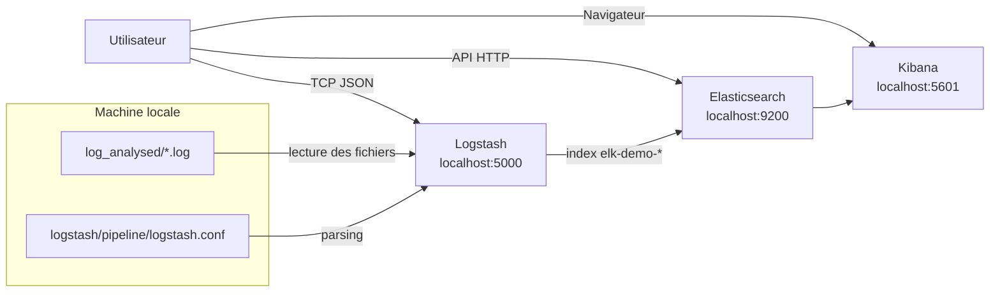

# Consigne 1 - Analyse des logs statiques avec ELK

Cette branche est dediee exclusivement a la `consigne 1`.

Objectif :

- demarrer une stack ELK locale
- ingerer les fichiers deja presents dans `log_analysed/`
- parser les evenements avec `Logstash`
- rechercher et analyser les logs dans `Kibana`

La branche `consigne-2-python-apps-filebeat` est reservee a la seconde consigne sur les logs dynamiques avec `server`, `client` et `Filebeat`.

## Architecture



## Ce que contient cette branche

```text
.
├── docker-compose.yml
├── logstash/
│   └── pipeline/
│       └── logstash.conf
├── log_analysed/
│   ├── user_service.log
│   ├── product_service.log
│   └── order_service.log
├── images/
└── README.md
```

## Prerequis

- Docker
- Docker Compose via `docker compose`

Verification rapide :

```bash
docker --version
docker compose version
```

## Ports utilises

- `9200` : Elasticsearch
- `5601` : Kibana
- `5000` : entree TCP JSON de Logstash

## Logs a analyser

Les fichiers fournis pour cette consigne sont :

- `log_analysed/user_service.log`
- `log_analysed/product_service.log`
- `log_analysed/order_service.log`

## Demarrage

Depuis la racine du projet :

```bash
cd /root/ELK
docker compose up -d
```

Verifier l'etat :

```bash
docker compose ps
```

## Utilisation avec Make

Depuis la racine du projet :

```bash
cd /root/ELK
make help
```

Pour cette consigne, la commande recommandee est :

```bash
make consigne1
```

Autres commandes utiles :

```bash
make status
make clean
make prune
```

Comportement :

- `make consigne1` bascule sur la branche `consigne-1-log-analysed` puis demarre ELK
- `make clean` arrete et supprime proprement les conteneurs et reseaux du projet
- `make prune` ajoute la suppression des volumes dedies et des logs generes
- `make status` affiche la branche courante et l'etat des services

## Flux de donnees

1. `Logstash` lit directement les fichiers du dossier `log_analysed/`
2. la pipeline parse les lignes et extrait les champs utiles
3. `Elasticsearch` stocke les documents dans `elk-demo-*`
4. `Kibana` permet la recherche, les filtres et les dashboards

## Champs extraits

La pipeline extrait notamment :

- `service`
- `level`
- `event_type`
- `http_method`
- `url_path`
- `status_code`
- `user_id`
- `user_name`
- `order_id`
- `product_name`

## Verification rapide

### Elasticsearch

```text
http://localhost:9200
```

### Kibana

```text
http://localhost:5601
```

Dans Kibana :

1. creer ou selectionner la Data View `elk-demo-*`
2. choisir `@timestamp` comme champ temporel
3. ouvrir `Discover`
4. utiliser une plage large si besoin

## Filtres KQL utiles

```text
event_type : "user_created"
```

```text
event_type : "order_created"
```

```text
event_type : "http_access"
```

```text
status_code : 404
```

```text
service : "user_service"
```

## Analyse attendue

Ce jeu de logs permet notamment d'observer :

- les creations d'utilisateurs
- les creations de commandes
- les acces HTTP
- les codes de statut
- une anomalie de type `404`

## Refaire l'environnement plus tard

### Relancer la stack

```bash
cd /root/ELK
docker compose up -d
```

### Arreter la stack

```bash
cd /root/ELK
docker compose down
```

### Repartir proprement

```bash
cd /root/ELK
docker compose down
docker compose up -d
```

## Fichiers importants

- [docker-compose.yml](/root/ELK/docker-compose.yml)
- [logstash.conf](/root/ELK/logstash/pipeline/logstash.conf)
- [user_service.log](/root/ELK/log_analysed/user_service.log)
- [product_service.log](/root/ELK/log_analysed/product_service.log)
- [order_service.log](/root/ELK/log_analysed/order_service.log)
