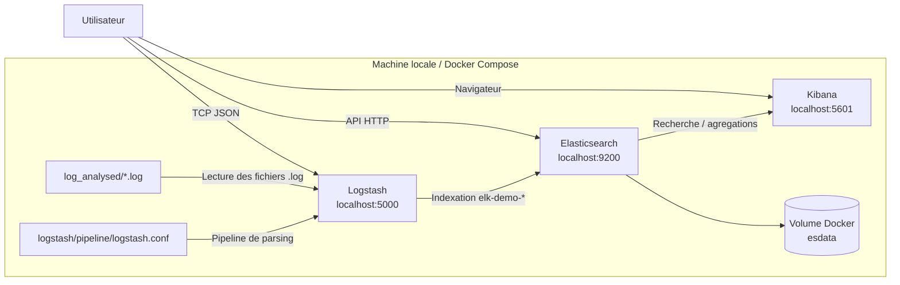

# ELK avec Docker Compose

Ce projet fournit une stack **ELK** simple a demarrer en local avec Docker Compose.

- **Elasticsearch** stocke et indexe les donnees
- **Logstash** recoit et transforme les logs
- **Kibana** permet de rechercher et visualiser les evenements

L'objectif est d'avoir un environnement pret pour apprendre ELK, faire des tests locaux, ou demarrer une petite demo rapidement.

Version Elastic utilisee par defaut :

- `8.19.11`

## Architecture

Le projet demarre 3 conteneurs principaux :

- `elasticsearch` sur le port `9200`
- `logstash` sur les ports `5000` et `5044`
- `kibana` sur le port `5601`

### Schema d'architecture



## Structure du projet

```text
.
├── docker-compose.yml
├── logstash/
│   └── pipeline/
│       └── logstash.conf
├── log_analysed/
├── images/
├── Makefile
├── scripts/
└── README.md
```

## Prerequis

- Docker installe
- Docker Compose disponible via `docker compose`

Verification rapide :

```bash
docker --version
docker compose version
```

## Demarrage direct

Place-toi dans le dossier du projet :

```bash
cd /root/ELK
```

Demarre la stack :

```bash
docker compose up -d
```

Verifie l'etat des conteneurs :

```bash
docker compose ps
```

## Utilisation avec Make

Le projet fournit aussi un [Makefile](/root/ELK/Makefile) pour piloter l'infrastructure plus rapidement.

Depuis la racine du projet :

```bash
cd /root/ELK
make help
```

Commandes disponibles sur `main` :

```bash
make consigne1
make consigne2
make consigne3
make status
make branch
make clean
make prune
```

### Demarrer une consigne

```bash
make consigne1
make consigne2
make consigne3
```

Effet :

- bascule automatiquement sur la bonne branche Git
- demarre la stack ELK
- demarre les services applicatifs lies a la consigne si necessaire

### Voir l'etat courant

```bash
make status
```

Affiche :

- la branche Git active
- l'etat des conteneurs ELK
- l'etat des conteneurs applicatifs si presents

### Voir la branche active

```bash
make branch
```

### Tout arreter proprement

```bash
make clean
```

Effet :

- arrete les applications Python si elles tournent
- arrete la stack ELK
- supprime les conteneurs du projet
- supprime le reseau dedie du projet

Utilise `make clean` si tu veux simplement tout arreter sans supprimer les volumes persistants.

### Tout nettoyer completement

```bash
make prune
```

Effet :

- execute d'abord `make clean`
- supprime les volumes Docker dedies au projet
- supprime les logs generes localement

Utilise `make prune` si tu veux repartir d'un environnement completement neuf.

### Exemples utiles

Demarrer une variante :

```bash
make consigne3
```

Verifier l'etat :

```bash
make status
```

Arreter proprement :

```bash
make clean
```

Repartir de zero :

```bash
make prune
```

## Verification

### Elasticsearch

```text
http://localhost:9200
```

### Kibana

```text
http://localhost:5601
```

## Fichiers importants

- [Makefile](/root/ELK/Makefile)
- [scripts/infra.sh](/root/ELK/scripts/infra.sh)
- [docker-compose.yml](/root/ELK/docker-compose.yml)
- [logstash.conf](/root/ELK/logstash/pipeline/logstash.conf)
