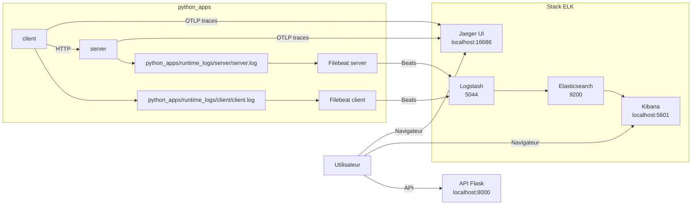

# Consigne 4 - Logs ELK + Jaeger UI pour les traces

Cette branche est dediee a une variante plus proche d'un cas reel avec logs et traces :

- le `server` ecrit ses logs dans son propre dossier
- le `client` ecrit ses logs dans son propre dossier
- chaque service a son propre `Filebeat`
- les deux `Filebeat` envoient ensuite les logs a `Logstash`
- `Logstash` alimente `Elasticsearch`
- `Kibana` sert a l'analyse
- `Jaeger UI` permet de visualiser les traces distribuees du `client` vers le `server`

Cette branche ne remplace pas les autres :

- `main` : branche de reference
- `consigne-1-log-analysed` : logs statiques dans `log_analysed/`
- `consigne-2-python-apps-filebeat` : logs dynamiques centralises dans un dossier partage
- `consigne-3-filebeat-par-service` : logs dynamiques avec un collecteur par service
- `consigne-4-jaeger-ui` : consigne 3 avec traces OTLP dans Jaeger UI

## Architecture



## Principe

Ici, on evite le dossier central `log_analysed/python_apps/`.

A la place :

- `server` ecrit dans `python_apps/runtime_logs/server/`
- `client` ecrit dans `python_apps/runtime_logs/client/`
- `filebeat-server` lit uniquement les logs du serveur
- `filebeat-client` lit uniquement les logs du client
- `server` exporte ses traces vers `jaeger:4317`
- `client` exporte ses traces vers `jaeger:4317`

Ce modele ressemble davantage a un environnement reel ou chaque machine ou service collecte ses propres logs localement avant de les envoyer a la plateforme d'observabilite.

## Contenu de la branche

```text
.
├── docker-compose.yml
├── logstash/
│   └── pipeline/
│       └── logstash.conf
├── python_apps/
│   ├── docker-compose.yml
│   ├── filebeat/
│   │   ├── server-filebeat.yml
│   │   └── client-filebeat.yml
│   ├── runtime_logs/
│   │   ├── server/
│   │   └── client/
│   ├── server/
│   ├── client/
│   └── README_fr-FR.md
└── README.md
```

## Prerequis

- Docker
- Docker Compose via `docker compose`

## Ports

- `8000` : API Flask exposee localement
- `9200` : Elasticsearch
- `5601` : Kibana
- `16686` : Jaeger UI
- `4317` : endpoint OTLP gRPC pour les traces
- `5044` : entree Beats de Logstash
- `5000` : entree TCP JSON optionnelle de Logstash

## Demarrage

### 1. Demarrer ELK

```bash
cd /root/ELK
docker compose up -d
```

### 2. Demarrer l'application et les collecteurs

```bash
cd /root/ELK/python_apps
docker compose up --build -d
```

## Utilisation avec Make

Depuis la racine du projet :

```bash
cd /root/ELK
make help
```

Pour cette consigne, la commande recommandee est :

```bash
make consigne4
```

Autres commandes utiles :

```bash
make status
make clean
make prune
```

Comportement :

- `make consigne3` bascule sur la branche `consigne-3-filebeat-par-service`, demarre ELK, puis demarre `python_apps`
- `make consigne4` bascule sur la branche `consigne-4-jaeger-ui`, demarre ELK + Jaeger, puis demarre `python_apps`
- `make clean` arrete et supprime proprement les conteneurs et reseaux du projet
- `make prune` ajoute la suppression des volumes dedies et des logs generes
- `make status` affiche la branche courante et l'etat des services

## Fonctionnement

1. `server` ecrit `server.log` dans `python_apps/runtime_logs/server/`
2. `client` ecrit `client.log` dans `python_apps/runtime_logs/client/`
3. `filebeat-server` lit uniquement `/srv/logs/*.log` monte depuis `runtime_logs/server/`
4. `filebeat-client` lit uniquement `/srv/logs/*.log` monte depuis `runtime_logs/client/`
5. les deux envoient vers `logstash:5044`
6. `Logstash` parse les lignes et enrichit les evenements
7. `Elasticsearch` les indexe
8. `Kibana` permet de les rechercher
9. `Jaeger` affiche les spans du `client` et du `server`

## Avantages de cette approche

- separation claire entre les sources de logs
- plus proche d'un deploiement reel
- plus simple a raisonner quand on ajoute d'autres services
- chaque collecteur peut etre configure independamment

## Verification

### API

```text
http://localhost:8000
```

### Kibana

```text
http://localhost:5601
```

Le projet recree automatiquement une Data View `demo`, une recherche sauvegardee `demo-logs` et un dashboard `demo` au demarrage de la stack ELK.

### Jaeger UI

```text
http://localhost:16686
```

Dans `Search`, choisis le service `api-client` ou `api-server` pour retrouver les traces.

Dans `Discover`, utilise la Data View `demo`, puis filtre par exemple :

```text
source_filename : "server.log"
```

```text
source_filename : "client.log"
```

```text
level : "ERROR" or level : "CRITICAL"
```

```text
event_type : "chaos_incident" or event_type : "system_alert"
```

```text
event_type : "client_connection_failed" or event_type : "client_timeout"
```

## Reconstruction rapide

### Tout lancer

```bash
cd /root/ELK
docker compose up -d

cd /root/ELK/python_apps
docker compose up --build -d
```

### Tout arreter

```bash
cd /root/ELK/python_apps
docker compose down

cd /root/ELK
docker compose down
```

### Repartir proprement

```bash
cd /root/ELK/python_apps
docker compose down

cd /root/ELK
docker compose down
docker compose up -d

cd /root/ELK/python_apps
docker compose up --build -d
```

Apres un `make prune` ou un `docker compose down -v`, les objets Kibana sont automatiquement recrées au prochain `docker compose up -d`.

## Fichiers importants

- [docker-compose.yml](/root/ELK/docker-compose.yml)
- [logstash.conf](/root/ELK/logstash/pipeline/logstash.conf)
- [python_apps/docker-compose.yml](/root/ELK/python_apps/docker-compose.yml)
- [server-filebeat.yml](/root/ELK/python_apps/filebeat/server-filebeat.yml)
- [client-filebeat.yml](/root/ELK/python_apps/filebeat/client-filebeat.yml)
- [README_fr-FR.md](/root/ELK/python_apps/README_fr-FR.md)
