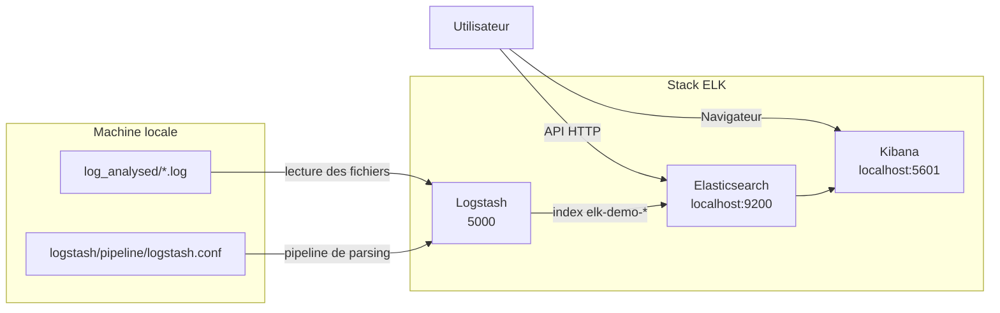

# Consigne 1 - Analyse de logs statiques avec ELK

Cette branche contient la premiere consigne du projet : ingerer des fichiers de logs deja presents, les parser avec `Logstash`, puis les exploiter dans `Kibana`.

## Objectif

- demarrer une stack ELK locale
- lire les fichiers du dossier `log_analysed/`
- transformer les evenements avec `Logstash`
- indexer les donnees dans `Elasticsearch`
- analyser les logs dans `Kibana`

## Perimetre de la branche

Cette branche reste volontairement simple :

- pas d'application Python a lancer
- pas de `Filebeat`
- pas de `Jaeger`
- uniquement des logs statiques fournis a l'avance

## Architecture



## Demarrage

Depuis la racine du projet :

```bash
cd /root/ELK
make consigne1
```

## Commandes utiles

```bash
make status
make clean
make prune
```

Effet des commandes :

- `make consigne1` bascule sur `consigne-1-log-analysed` puis lance ELK
- `make status` affiche la branche active et l'etat des conteneurs
- `make clean` arrete proprement l'environnement
- `make prune` supprime en plus les volumes et les logs generes

## Fichiers de logs analyses

- `log_analysed/user_service.log`
- `log_analysed/product_service.log`
- `log_analysed/order_service.log`

## Verification

- Kibana : `http://localhost:5601`
- Elasticsearch : `http://localhost:9200`

Dans Kibana :

1. creer ou selectionner la Data View `elk-demo-*`
2. choisir `@timestamp` comme champ temporel
3. ouvrir `Discover`
4. utiliser une plage de temps large si besoin

## Exemples de filtres KQL

```text
event_type : "user_created"
```

```text
event_type : "order_created"
```

```text
service : "user_service"
```

```text
status_code : 404
```

## Fichiers importants

- [docker-compose.yml](/root/elk-worktrees/consigne1/docker-compose.yml)
- [logstash/pipeline/logstash.conf](/root/elk-worktrees/consigne1/logstash/pipeline/logstash.conf)
- [Makefile](/root/elk-worktrees/consigne1/Makefile)
- [scripts/infra.sh](/root/elk-worktrees/consigne1/scripts/infra.sh)
