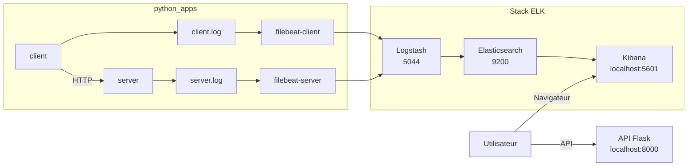

# Consigne 3 - Un Filebeat par service

Cette branche fait evoluer `python_apps` vers une organisation plus realiste : chaque service ecrit ses logs dans son propre dossier, et chaque source est collecte par son propre conteneur `Filebeat`.

## Objectif

- separer les logs du `client` et du `server`
- deployer un `Filebeat` dedie a chaque service
- conserver une pipeline `Logstash` commune
- centraliser ensuite les evenements dans `Elasticsearch` et `Kibana`

## Principe

Ici, on ne passe plus par un dossier partage unique. A la place :

- `server` ecrit dans `python_apps/runtime_logs/server/`
- `client` ecrit dans `python_apps/runtime_logs/client/`
- `filebeat-server` lit uniquement les logs du serveur
- `filebeat-client` lit uniquement les logs du client

## Architecture



## Demarrage

Depuis la racine du projet :

```bash
cd /root/ELK
make consigne3
```

## Commandes utiles

```bash
make status
make clean
make prune
```

Effet des commandes :

- `make consigne3` bascule sur `consigne-3-filebeat-par-service`, lance ELK, puis `python_apps`
- `make status` affiche les conteneurs ELK et applicatifs
- `make clean` arrete l'environnement
- `make prune` supprime aussi les volumes et les logs generes

## Emplacements des logs

- `python_apps/runtime_logs/server/server.log`
- `python_apps/runtime_logs/client/client.log`

## Verification

- API Flask : `http://localhost:8000`
- Kibana : `http://localhost:5601`
- Elasticsearch : `http://localhost:9200`

Dans Kibana, tu peux filtrer par exemple avec :

```text
source_filename : "server.log"
```

```text
source_filename : "client.log"
```

```text
level : "ERROR" or level : "CRITICAL"
```

## Fichiers importants

- [docker-compose.yml](/root/ELK/docker-compose.yml)
- [python_apps/docker-compose.yml](/root/ELK/python_apps/docker-compose.yml)
- [python_apps/filebeat/server-filebeat.yml](/root/ELK/python_apps/filebeat/server-filebeat.yml)
- [python_apps/filebeat/client-filebeat.yml](/root/ELK/python_apps/filebeat/client-filebeat.yml)
- [Makefile](/root/ELK/Makefile)
- [scripts/infra.sh](/root/ELK/scripts/infra.sh)
