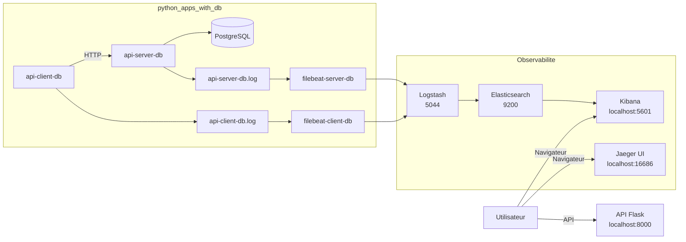

# Consigne 5 - `python_apps_with_db` avec PostgreSQL et ELK

Cette branche introduit une nouvelle variante applicative avec base de donnees : `python_apps_with_db`. Le `server` s'appuie sur `PostgreSQL`, le `client` genere du trafic, et les logs restent centralises dans ELK.

## Objectif

- deployer un `server` Python relie a `PostgreSQL`
- deployer un `client` dedie a cette variante
- conserver une separation claire des logs applicatifs
- retrouver les logs du `client`, du `server` et des operations SQL dans `Kibana`

## Principe

La variante base de donnees se distingue explicitement de `python_apps` :

- `api-server-db` pour le serveur
- `api-client-db` pour le client
- `db` pour PostgreSQL
- `filebeat-server-db` et `filebeat-client-db` pour la collecte

Les variables d'environnement PostgreSQL attendues par le serveur sont :

```text
DB_HOST=db
DB_NAME=postgres
DB_USER=postgres
DB_PASSWORD=postgres
```

## Architecture



## Demarrage

Depuis la racine du projet :

```bash
cd /root/ELK
make consigne5
```

## Commandes utiles

```bash
make status
make clean
make prune
```

Effet des commandes :

- `make consigne5` bascule sur `consigne-5-python-apps-with-db`, lance ELK, puis `python_apps_with_db`
- `make status` affiche l'etat de la stack et des services avec base de donnees
- `make clean` arrete proprement tous les conteneurs
- `make prune` supprime aussi les volumes et les logs generes

## Verification

- API Flask : `http://localhost:8000`
- Kibana : `http://localhost:5601`
- Jaeger UI : `http://localhost:16686`

Fichiers de logs distinctifs :

- `python_apps_with_db/runtime_logs/server/api-server-db.log`
- `python_apps_with_db/runtime_logs/client/api-client-db.log`

Filtres KQL utiles :

```text
source_filename : "api-server-db.log"
```

```text
source_filename : "api-client-db.log"
```

```text
message : "*PostgreSQL*" or message : "*database*"
```

```text
level : "ERROR" or level : "CRITICAL"
```

## Fichiers importants

- [docker-compose.yml](/root/elk-worktrees/consigne5/docker-compose.yml)
- [python_apps_with_db/docker-compose.yml](/root/elk-worktrees/consigne5/python_apps_with_db/docker-compose.yml)
- [python_apps_with_db/server/server.py](/root/elk-worktrees/consigne5/python_apps_with_db/server/server.py)
- [python_apps_with_db/client/client.py](/root/elk-worktrees/consigne5/python_apps_with_db/client/client.py)
- [Makefile](/root/elk-worktrees/consigne5/Makefile)
- [scripts/infra.sh](/root/elk-worktrees/consigne5/scripts/infra.sh)
