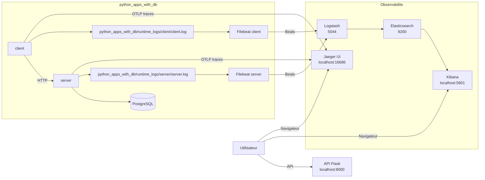

# Consigne 5 - python_apps_with_db avec PostgreSQL, ELK et logs applicatifs

Cette branche ajoute une nouvelle variante basee sur `python_apps_with_db`.

Objectif :

- demarrer un `server` Flask relie a PostgreSQL
- demarrer un `client` qui genere du trafic, y compris vers un endpoint `/fake`
- ecrire les logs du `server` et du `client` dans des dossiers dedies
- collecter ces logs avec un `Filebeat` par service
- envoyer les evenements vers `Logstash`, `Elasticsearch` puis `Kibana`

La stack racine conserve aussi `Jaeger UI`, deja presente sur les branches recentes.

## Branches disponibles

- `main` : branche de reference
- `consigne-1-log-analysed` : logs statiques dans `log_analysed/`
- `consigne-2-python-apps-filebeat` : logs dynamiques centralises
- `consigne-3-filebeat-par-service` : un Filebeat par service
- `consigne-4-jaeger-ui` : consigne 3 avec Jaeger UI
- `consigne-5-python-apps-with-db` : `python_apps_with_db` + PostgreSQL + ELK

## Architecture



## Ports

- `8000` : API Flask
- `9200` : Elasticsearch
- `5601` : Kibana
- `16686` : Jaeger UI
- `4317` : OTLP gRPC
- `5044` : entree Beats de Logstash
- `5000` : entree TCP JSON optionnelle de Logstash

## Demarrage

### 1. Demarrer ELK

```bash
cd /root/ELK
docker compose up -d
```

### 2. Demarrer l'application avec PostgreSQL

```bash
cd /root/ELK/python_apps_with_db
docker compose up --build -d
```

## Utilisation avec Make

Depuis la racine du projet :

```bash
cd /root/ELK
make help
```

Commande recommandee pour cette branche :

```bash
make consigne5
```

Autres commandes utiles :

```bash
make status
make clean
make prune
```

## Fonctionnement

1. `db` demarre PostgreSQL.
2. `server` initialise la base puis ecrit `server.log` dans `python_apps_with_db/runtime_logs/server/`.
3. `client` ecrit `client.log` dans `python_apps_with_db/runtime_logs/client/`.
4. `filebeat-server` lit uniquement les logs du serveur.
5. `filebeat-client` lit uniquement les logs du client.
6. les deux envoient les evenements vers `logstash:5044`.
7. `Logstash` parse les lignes et enrichit les evenements.
8. `Elasticsearch` les indexe.
9. `Kibana` permet de rechercher les logs.

## Verification

### API

```text
http://localhost:8000
```

### Kibana

```text
http://localhost:5601
```

### Jaeger UI

```text
http://localhost:16686
```

Dans `Discover`, utilise la Data View `demo`, puis essaye par exemple :

```text
source_filename : "server.log"
```

```text
source_filename : "client.log"
```

```text
message : "*database*" or message : "*PostgreSQL*" or message : "*Fake query failed*"
```

```text
level : "ERROR" or level : "CRITICAL"
```

## Reconstruction rapide

### Tout lancer

```bash
cd /root/ELK
docker compose up -d

cd /root/ELK/python_apps_with_db
docker compose up --build -d
```

### Tout arreter

```bash
cd /root/ELK/python_apps_with_db
docker compose down

cd /root/ELK
docker compose down
```

### Repartir proprement

```bash
cd /root/ELK/python_apps_with_db
docker compose down

cd /root/ELK
docker compose down
docker compose up -d

cd /root/ELK/python_apps_with_db
docker compose up --build -d
```

## Fichiers importants

- [docker-compose.yml](/root/ELK/docker-compose.yml)
- [logstash.conf](/root/ELK/logstash/pipeline/logstash.conf)
- [python_apps_with_db/docker-compose.yml](/root/ELK/python_apps_with_db/docker-compose.yml)
- [server-filebeat.yml](/root/ELK/python_apps_with_db/filebeat/server-filebeat.yml)
- [client-filebeat.yml](/root/ELK/python_apps_with_db/filebeat/client-filebeat.yml)
- [README_fr-FR.md](/root/ELK/python_apps_with_db/README_fr-FR.md)
