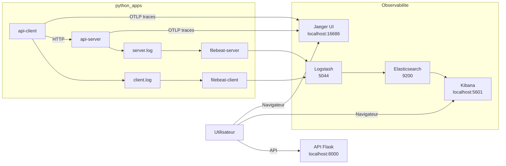

# Consigne 4 - ELK + Jaeger UI pour les traces

Cette branche reprend l'organisation de la consigne 3 et ajoute une brique d'observabilite supplementaire : le tracing distribue avec `Jaeger UI`.

## Objectif

- conserver la collecte de logs par service
- visualiser les logs dans `Kibana`
- exporter les traces du `client` et du `server`
- visualiser les spans dans `Jaeger UI`

## Principe

La partie logs reste separee par service :

- `server` ecrit ses logs dans `python_apps/runtime_logs/server/`
- `client` ecrit ses logs dans `python_apps/runtime_logs/client/`
- chaque source a son propre `Filebeat`

En plus :

- `client` exporte ses traces vers `Jaeger`
- `server` exporte ses traces vers `Jaeger`

## Architecture



## Demarrage

Depuis la racine du projet :

```bash
cd /root/ELK
make consigne4
```

## Commandes utiles

```bash
make status
make clean
make prune
```

Effet des commandes :

- `make consigne4` bascule sur `consigne-4-jaeger-ui`, lance ELK, `Jaeger` puis `python_apps`
- `make status` affiche l'etat de la stack d'observabilite et des applications
- `make clean` arrete l'ensemble de l'environnement
- `make prune` supprime aussi les volumes et les logs generes

## Verification

- API Flask : `http://localhost:8000`
- Kibana : `http://localhost:5601`
- Jaeger UI : `http://localhost:16686`

Dans Jaeger, tu peux rechercher :

- `api-client`
- `api-server`

Dans Kibana, tu peux filtrer avec :

```text
source_filename : "server.log"
```

```text
source_filename : "client.log"
```

```text
level : "ERROR" or level : "CRITICAL"
```

La stack recree aussi automatiquement la Data View `demo`, une recherche sauvegardee `demo-logs` et un dashboard `demo`.

## Fichiers importants

- [docker-compose.yml](/root/ELK/docker-compose.yml)
- [python_apps/docker-compose.yml](/root/ELK/python_apps/docker-compose.yml)
- [scripts/kibana-bootstrap.sh](/root/ELK/scripts/kibana-bootstrap.sh)
- [Makefile](/root/ELK/Makefile)
- [scripts/infra.sh](/root/ELK/scripts/infra.sh)
