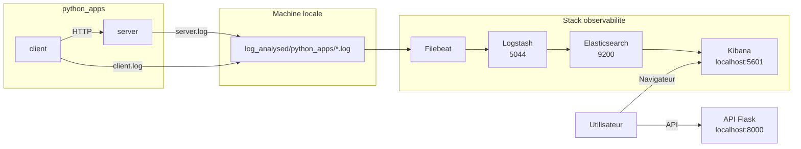

# Consigne 2 - Logs dynamiques avec `python_apps` et Filebeat

Cette branche introduit une application Python composee d'un `server` et d'un `client`. Les logs sont produits dynamiquement, collectes par `Filebeat`, puis envoyes vers la stack ELK.

## Objectif

- demarrer un `server` Flask et un `client`
- generer des logs applicatifs dynamiques
- collecter ces logs avec `Filebeat`
- parser les evenements avec `Logstash`
- visualiser les logs dans `Kibana`

## Principe

Dans cette consigne :

- le `server` ecrit `server.log`
- le `client` ecrit `client.log`
- les deux fichiers sont centralises dans `log_analysed/python_apps/`
- un `Filebeat` les surveille puis les transfere vers `Logstash`

## Architecture



## Demarrage

Depuis la racine du projet :

```bash
cd /root/ELK
make consigne2
```

## Commandes utiles

```bash
make status
make clean
make prune
```

Effet des commandes :

- `make consigne2` bascule sur `consigne-2-python-apps-filebeat`, lance ELK, puis `python_apps`
- `make status` affiche la branche active et l'etat des services
- `make clean` arrete l'environnement sans supprimer les volumes persistants
- `make prune` supprime aussi les volumes et les logs generes

## Emplacements des logs

- `log_analysed/python_apps/server.log`
- `log_analysed/python_apps/client.log`

## Verification

- API Flask : `http://localhost:8000`
- Kibana : `http://localhost:5601`
- Elasticsearch : `http://localhost:9200`

Dans Kibana, la Data View `demo` ou `elk-demo-*` permet ensuite de filtrer les evenements.

## Filtres KQL utiles

```text
source_filename : "server.log"
```

```text
source_filename : "client.log"
```

```text
level : "ERROR" or level : "CRITICAL"
```

```text
event_type : "client_connection_failed" or event_type : "client_timeout"
```

## Fichiers importants

- [docker-compose.yml](/root/elk-worktrees/consigne2/docker-compose.yml)
- [python_apps/docker-compose.yml](/root/elk-worktrees/consigne2/python_apps/docker-compose.yml)
- [filebeat/filebeat.yml](/root/elk-worktrees/consigne2/filebeat/filebeat.yml)
- [Makefile](/root/elk-worktrees/consigne2/Makefile)
- [scripts/infra.sh](/root/elk-worktrees/consigne2/scripts/infra.sh)
