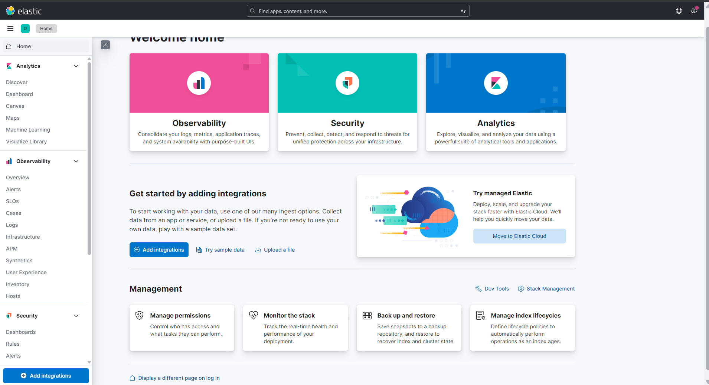
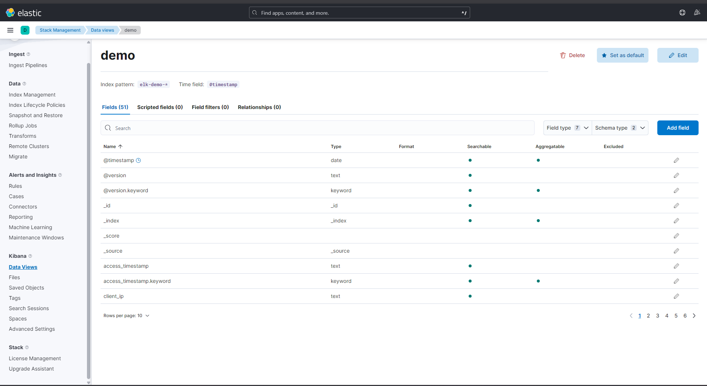
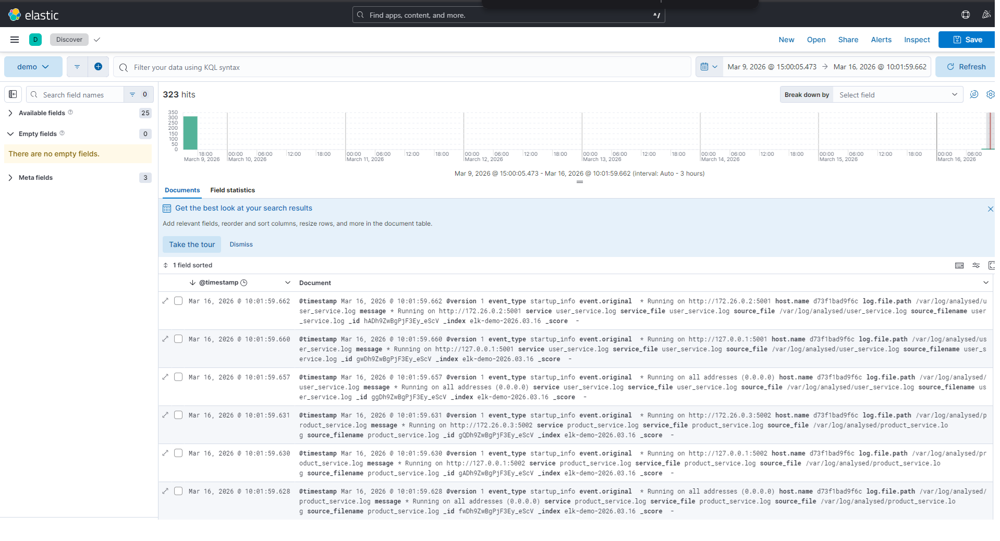
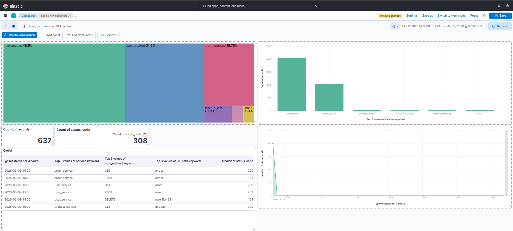

# ELK avec Docker Compose

Ce projet fournit une stack **ELK** simple à démarrer en local avec Docker Compose.

- **Elasticsearch** stocke et indexe les données
- **Logstash** reçoit et transforme les logs
- **Kibana** permet de rechercher et visualiser les événements

L'objectif est d'avoir un environnement prêt pour apprendre ELK, faire des tests locaux, ou démarrer une petite démo rapidement.

Version Elastic utilisée par défaut :

- `8.19.11`

## Architecture

Le projet démarre 3 conteneurs principaux :

- `elasticsearch` sur le port `9200`
- `logstash` sur les ports `5000` et `5044`
- `kibana` sur le port `5601`

### Schema d'architecture


### Lecture du schema

1. Les logs applicatifs sont stockes dans `log_analysed/`
2. Docker monte ce dossier dans le conteneur `logstash`
3. Logstash lit les fichiers, nettoie les logs et extrait les champs utiles
4. Les evenements sont envoyes dans Elasticsearch dans les index `elk-demo-*`
5. Kibana interroge Elasticsearch pour afficher les logs, filtres, tableaux et dashboards

### Flux principal

```text
log_analysed/*.log
   -> Logstash
   -> Elasticsearch
   -> Kibana
```

## Structure du projet

```text
.
├── docker-compose.yml
├── logstash
│   └── pipeline
│       └── logstash.conf
├── logs
│   └── app.log
├── log_analysed
│   ├── order_service.log
│   ├── product_service.log
│   └── user_service.log
├── images
│   ├── Welcome.png
│   ├── data_views.png
│   ├── Discover.png
│   └── dashboard.png
└── README.md
```

## Prérequis

- Docker installé
- Docker Compose disponible via `docker compose`
- Au moins 4 Go de RAM alloués à Docker

Vérification rapide :

```bash
docker --version
docker compose version
```

## Fichiers importants

### `docker-compose.yml`

Déclare les 3 services ELK :

- Elasticsearch en mode `single-node`
- Logstash avec la pipeline montée depuis le dossier local
- Kibana connecté à Elasticsearch

Reglages Elasticsearch utilises dans la stack :

- `discovery.type=single-node`
  Pas de cluster, un seul noeud Elasticsearch pour le TP
- `xpack.security.enabled=false`
  Securite desactivee pour simplifier les tests en local
- `ES_JAVA_OPTS="-Xms512m -Xmx512m"`
  Limitation memoire a 512 Mo pour reduire la consommation RAM

### `logstash/pipeline/logstash.conf`

Cette pipeline :

- lit tous les fichiers `*.log` du dossier `/var/log/demo`
- écoute aussi sur le port TCP `5000` au format JSON
- envoie tout dans l'index `elk-demo-YYYY.MM.dd`

### `log_analysed/`

Dossier principal pour la consigne.

Il contient les logs à analyser :

- `user_service.log`
- `product_service.log`
- `order_service.log`

La pipeline Logstash extrait automatiquement plusieurs champs utiles :

- `service`
- `level`
- `event_type`
- `http_method`
- `url_path`
- `status_code`
- `user_id`
- `user_name`
- `order_id`
- `product_name`

## Démarrage du projet

Place-toi dans le dossier du projet :

```bash
cd /root/ELK
```

Démarre la stack :

```bash
docker compose up -d
```

Vérifie l'état des conteneurs :

```bash
docker compose ps
```

Consulte les logs si besoin :

```bash
docker compose logs -f
```

## Utilisation avec Make

Le projet fournit aussi un [Makefile](/root/ELK/Makefile) pour piloter l'infrastructure plus rapidement.

Depuis la racine du projet :

```bash
cd /root/ELK
make help
```

Commandes principales :

```bash
make consigne1
make consigne2
make consigne3
make clean
make prune
make status
```

Comportement :

- `make consigne1` bascule sur la branche `consigne-1-log-analysed` puis déploie la stack de la consigne 1
- `make consigne2` bascule sur la branche `consigne-2-python-apps-filebeat` puis déploie la stack de la consigne 2
- `make consigne3` bascule sur la branche `consigne-3-filebeat-par-service` puis déploie la stack de la consigne 3
- `make clean` arrête et supprime proprement les conteneurs et réseaux du projet
- `make prune` fait un nettoyage plus complet en supprimant aussi les volumes dédiés et les logs générés
- `make status` affiche la branche active et l'état des conteneurs

Exemple :

```bash
make consigne1
make status
make clean
```

## Vérifier que tout fonctionne

### Elasticsearch

Ouvre dans ton navigateur :

```text
http://localhost:9200
```

Ou teste dans le terminal :

```bash
curl http://localhost:9200
```

Si tout va bien, tu verras un JSON avec le nom du nœud, la version et le cluster.

### Kibana

Ouvre :

```text
http://localhost:5601
```

Kibana peut mettre 30 à 90 secondes à être complètement prêt après le démarrage.

### Logstash

Important : `http://localhost:5000` ne doit pas être ouvert dans un navigateur.

Le port `5000` n'est pas une interface web. C'est une **entrée TCP** utilisée par Logstash pour recevoir des événements JSON.

## Captures d'ecran

Quelques captures du projet sont incluses dans le depot :

### Page d'accueil Kibana



### Data View creee pour les logs



### Exploration des logs dans Discover



### Dashboard de visualisation



## Comment utiliser la stack

### Cas 1. Lire les logs de `log_analysed`

Le dossier local `./log_analysed` est monté dans le conteneur Logstash.

Tous les fichiers avec l'extension `.log` sont lus automatiquement.

Ces événements seront envoyés dans Elasticsearch dans un index de type :

```text
elk-demo-2026.03.16
```

Ce que Logstash détecte dans ces fichiers :

- les créations d'utilisateurs
- les créations de commandes
- les requêtes HTTP `GET` et `POST`
- les codes de statut `200` et `201`
- les messages de démarrage des services

### Cas 2. Envoyer un événement JSON à Logstash

Tu peux aussi injecter des événements en direct via le port TCP `5000`.

Exemple :

```bash
printf '{"service":"api","level":"info","message":"hello from tcp"}\n' | nc localhost 5000
```

Autre exemple :

```bash
printf '{"service":"billing","level":"error","message":"payment failed","user_id":42}\n' | nc localhost 5000
```

## Afficher les logs dans Kibana

Une fois Kibana disponible :

1. Ouvre `http://localhost:5601`
2. Va dans `Stack Management`
3. Ouvre `Data Views`
4. Clique sur `Create data view`
5. Saisis le pattern :

```text
elk-demo-*
```

6. Choisis `@timestamp` comme champ temporel si Kibana le propose
7. Ouvre ensuite `Discover`

Tu verras les événements ingérés par Logstash.

## Analyse conseillée pour la consigne

Une fois les logs chargés dans Kibana, tu peux faire cette analyse.

### 1. Vérifier les services présents

Dans `Discover`, filtre sur le champ `service`.

Tu devrais retrouver :

- `user_service`
- `product_service`
- `order_service`

### 2. Compter les événements par type

Regarde le champ `event_type` pour distinguer :

- `user_created`
- `order_created`
- `business_request`
- `http_access`
- `startup_info`
- `startup_warning`

### 3. Analyser les utilisateurs créés

Filtre :

```text
event_type : "user_created"
```

Champs intéressants :

- `user_id`
- `user_name`
- `service`
- `@timestamp`

### 4. Analyser les commandes créées

Filtre :

```text
event_type : "order_created"
```

Champs intéressants :

- `order_id`
- `user_id`
- `product_name`
- `service`

### 5. Analyser les accès HTTP

Filtre :

```text
event_type : "http_access"
```

Tu peux ensuite regarder :

- `http_method`
- `url_path`
- `status_code`
- `client_ip`

### 6. Faire des visualisations utiles

Dans `Visualize` ou `Lens`, je te conseille :

- un camembert par `service`
- un histogramme par `event_type`
- un tableau des `product_name` les plus commandés
- un tableau des `user_name` les plus fréquents
- une répartition des `status_code`

## Scénario de test complet

Voici un test simple du début à la fin :

1. Démarrer la stack

```bash
docker compose up -d
```

2. Vérifier que les fichiers de `log_analysed/` sont présents

```bash
ls log_analysed
```

3. Ouvrir Kibana

```text
http://localhost:5601
```

4. Créer la data view `elk-demo-*`

5. Aller dans `Discover` et rafraîchir

Tu devrais alors voir les événements des trois services apparaître.

## Commandes utiles

Démarrer :

```bash
docker compose up -d
```

Arrêter :

```bash
docker compose down
```

Supprimer aussi les volumes :

```bash
docker compose down -v
```

Voir les logs des conteneurs :

```bash
docker compose logs -f
```

Redémarrer la stack :

```bash
docker compose restart
```

Reconstruire proprement :

```bash
docker compose down -v
docker compose up -d
```

## Dépannage

### Kibana ne s'ouvre pas

Attends un peu après le `docker compose up -d`, puis vérifie :

```bash
docker compose ps
docker compose logs kibana
```

### Elasticsearch répond mais pas Kibana

C'est fréquent au démarrage. Elasticsearch est souvent prêt avant Kibana.

### `localhost:5000` ne montre rien dans le navigateur

C'est normal.

Le port `5000` n'est pas un site web. Il sert uniquement à recevoir des données TCP pour Logstash.

### Les nouveaux logs n'apparaissent pas

Vérifie :

```bash
docker compose logs logstash
```

Puis vérifie que `log_analysed/` est bien monté et que Logstash lit les bons fichiers :

```bash
docker compose exec logstash ls /var/log/analysed
```

### Plus assez de mémoire

Si Docker manque de RAM, Elasticsearch ou Kibana peuvent démarrer lentement ou planter.

Dans ce cas, augmente la mémoire allouée à Docker Desktop ou ajuste les options Java dans `docker-compose.yml`.

## Limites de cette configuration

Cette stack est pensée pour le local et la démonstration.

- la sécurité Elasticsearch est désactivée
- il n'y a pas d'authentification
- il n'y a pas de persistance avancée ni de tuning production

Pour un usage de production, il faut ajouter :

- sécurité et gestion des mots de passe
- certificats TLS
- monitoring
- sauvegardes
- réglages mémoire et disque

## Résumé

Pour utiliser ce projet :

1. lance `docker compose up -d`
2. ouvre `http://localhost:5601`
3. crée la data view `elk-demo-*`
4. vérifie les champs extraits dans `Discover`
5. analyse les événements par service et par type
