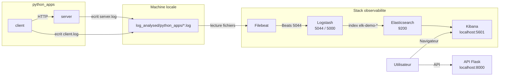

# Consigne 2 - Logs dynamiques avec Filebeat et ELK

Cette branche est dediee exclusivement a la `consigne 2`.

Objectif :

- demarrer une application Python composee d'un `server` et d'un `client`
- generer des logs dynamiques dans `log_analysed/python_apps/`
- collecter ces logs avec `Filebeat`
- les parser avec `Logstash`
- les indexer dans `Elasticsearch`
- les analyser dans `Kibana`

La branche `main` et la branche `consigne-1-log-analysed` restent reservees a la premiere consigne sur les logs statiques.

## Architecture



## Ce que contient cette branche

```text
.
├── docker-compose.yml
├── filebeat/
│   └── filebeat.yml
├── logstash/
│   └── pipeline/
│       └── logstash.conf
├── log_analysed/
│   └── python_apps/
├── python_apps/
│   ├── docker-compose.yml
│   ├── server/
│   ├── client/
│   └── README_fr-FR.md
└── README.md
```

## Prerequis

- Docker
- Docker Compose via `docker compose`

Verification rapide :

```bash
docker --version
docker compose version
```

## Ports utilises

- `8000` : API Flask exposee en local
- `9200` : Elasticsearch
- `5601` : Kibana
- `5044` : entree Beats de Logstash
- `5000` : entree TCP JSON optionnelle de Logstash

## Demarrage

### 1. Demarrer la stack ELK

Depuis la racine du projet :

```bash
cd /root/ELK
docker compose up -d
```

Verifier l'etat :

```bash
docker compose ps
```

### 2. Demarrer l'application Python

Dans un second terminal :

```bash
cd /root/ELK/python_apps
docker compose up --build -d
```

## Utilisation avec Make

Depuis la racine du projet :

```bash
cd /root/ELK
make help
```

Pour cette consigne, la commande recommandee est :

```bash
make consigne2
```

Autres commandes utiles :

```bash
make status
make clean
make prune
```

Comportement :

- `make consigne2` bascule sur la branche `consigne-2-python-apps-filebeat`, demarre ELK, puis demarre `python_apps`
- `make clean` arrete et supprime proprement les conteneurs et reseaux du projet
- `make prune` ajoute la suppression des volumes dedies et des logs generes
- `make status` affiche la branche courante et l'etat des services

Verifier l'etat :

```bash
docker compose ps
```

## Flux de logs

1. `python_apps/server` ecrit `server.log`
2. `python_apps/client` ecrit `client.log`
3. les fichiers sont stockes sur l'hote dans `log_analysed/python_apps/`
4. `Filebeat` surveille ces fichiers
5. `Filebeat` envoie les nouvelles lignes a `Logstash`
6. `Logstash` extrait les champs utiles
7. `Elasticsearch` stocke les evenements
8. `Kibana` permet la recherche et l'analyse

## Fichiers de logs attendus

Les logs dynamiques sont ecrits ici :

```text
log_analysed/python_apps/server.log
log_analysed/python_apps/client.log
```

## Champs extraits dans ELK

La pipeline parse notamment :

- `level`
- `log_detail`
- `source_filename`
- `trace_id`
- `span_id`
- `logger_name`
- `status_code`
- `url_path`
- `request_latency_seconds`
- `event_type`

## Evenements utiles dans Kibana

Filtres KQL recommandes :

```text
source_filename : "server.log"
```

```text
source_filename : "client.log"
```

```text
level : "ERROR" or level : "CRITICAL"
```

```text
event_type : "chaos_incident" or event_type : "system_alert"
```

```text
event_type : "client_connection_failed" or event_type : "client_timeout"
```

## Verification rapide

### API Flask

```text
http://localhost:8000
```

### Kibana

```text
http://localhost:5601
```

Dans Kibana :

1. ouvrir `Discover`
2. selectionner la Data View `demo`
3. choisir une plage large comme `Last 24 hours`
4. filtrer sur `server.log` ou `client.log`

## Refaire l'environnement plus tard

### Relancer uniquement ELK

```bash
cd /root/ELK
docker compose up -d
```

### Relancer uniquement l'application

```bash
cd /root/ELK/python_apps
docker compose up --build -d
```

### Tout arreter

```bash
cd /root/ELK/python_apps
docker compose down

cd /root/ELK
docker compose down
```

### Repartir proprement

```bash
cd /root/ELK/python_apps
docker compose down

cd /root/ELK
docker compose down
docker compose up -d

cd /root/ELK/python_apps
docker compose up --build -d
```

## Incident attendu

Le `server` contient un simulateur de chaos.

Il peut provoquer :

- un pic CPU
- une fuite memoire
- un crash brutal

Les symptomes visibles dans Kibana sont en general :

- `ERROR` et `CRITICAL` dans `server.log`
- `chaos_incident`
- `system_alert`
- `CONNECTION FAILED` dans `client.log`

## Fichiers importants

- [docker-compose.yml](/root/ELK/docker-compose.yml)
- [filebeat.yml](/root/ELK/filebeat/filebeat.yml)
- [logstash.conf](/root/ELK/logstash/pipeline/logstash.conf)
- [python_apps/docker-compose.yml](/root/ELK/python_apps/docker-compose.yml)
- [python_apps/README_fr-FR.md](/root/ELK/python_apps/README_fr-FR.md)
